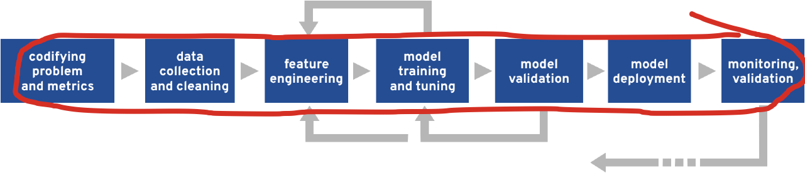

# From Statistics to Serverless: Machine Learning on OpenShift 4

This repository contains the materials from a hands-on tutorial on machine learning workflows using OpenShift 4. 

The workshop steps through the machine learning workflow for the concrete use case of detecting fraudulent transactions.

The goal of this workshop is to show application developers how data scientists approach a problem, illustrate some pain points data scientists have, and highlight ways in which OpenShift makes the machine learning workflow easier. 

The full machine learning workflow is covered by this workshop. 

You'll be exposed to the following tools, technologies and machine learning concepts in this workshop: 

### Tools and technologies
- Jupyter Notebooks
- Python Libraries for data science
	- pandas
	- numpy
	- scikit-learn
	- Altair
- Scikit learn pipelines 
- Prometheus
- Tekton
- K-native

### Concepts and techniques
- Natural Language Processing (NLP) techniques:
	- k-shingles 
	- tf-idf
- Visualising data	
	- declarative visualisation 
- Dimensionality reduction techniques 
   - Principal component analysis (PCA)
   - t-SNE
- Model evaluation techniques
- Custom Feature engineering approaches
- Modelling
	- Models for binary classification
- Dealing with imbalanced classes
- Monitoring a model in production

The notebooks are numbered sequentially and should be run in order. In some cases, if you don't run all cells in the notebook you will not be able to complete the subsequent notebooks.  

### Deploying the workshop

To deploy the workshop on an RHPDS cluster, visit the [deploy script](deploy/deploy.md). 

If you don't have access to an RHPDS cluster you will still be able to run the first few notebooks in this workshop locally. 

####ß Install the notebooks and dependencies

1.  Clone this repository:  `git clone https://github.com/aicoe-fde/fraud-notebooks`
    - tip:  if you don't have `git` installed, you can also [download an archive of this repository](https://github.com/willb/ml-workflows-notebook/archive/master.zip)
2.  Change to this repository's directory:  `cd fraud-notebooks`
3.  Install the dependencies:  `pipenv install --skip-lock`
4.  Run the notebooks:  `pipenv run jupyter notebook`

This lab was originally presented by @sophwats, @willb and @mbogoevici at Red Hat Summit in April 2020 and again at IBM Think in May 2020.

