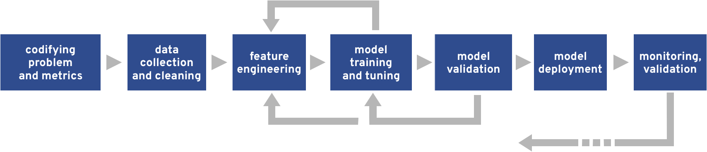

# From Zero to Data Science Hero
## Self guided learning materials for getting up to speed on all things Data Science

This content is designed to enable engineers and software developers to learn the tools, techniques and terminology needed to navigate the world of machine learning and data science. 

_Everything in this repo should be self contained and fully documented. Please file an issue on the repo if you find any bugs or notice something is unclear or incorrect!_ 

The content is divided into a set of hands-on workshops, each of which steps through the machine learning workflow in the context of a concrete application. In each workshop you'll learn some machine learning concepts and potential pitfalls, and get a chance try things out for yourself.

### Preliminaries

The majority of the content will be presented in [Jupyter notebooks](https://jupyter-notebook.readthedocs.io/en/stable/). Before you dive into the workshops, we recommend you work through [this notebook](00-jupyter-notebooks.ipynb) to get comfortable with the Jupyter Notebook environment. 

### Workshops

Each workshop focuses on stages of the machine learning workflow. You'll find more information about the contents of each workshop in the corresponding README. 

#### [00-ml-workflows](00-ml-workflows)

This workshop covers the stages of the machine learning workflow up to production. You will be able to train a couple of models and compare their performance when applied to the use case of spam detection. 

<!--
The content in this repo is divided into five sections: 

### 00-Preliminaries 
This section covers introductory topics, tools and techniques which underpins the content in future sections. After completing this section you will know: 

- how to use Python within interactive Jupyter notebooks, 
- the 7 stages of the machine learning workflow,
- some basic data science and machine learning concepts, and
- how to evaluate the performance of a machine learning model. 

### 01-Data Engineering and Data Cleaning

Data engineering and data cleaning is often overlooked in machine learning workshops, bootcamps and tutorials because it can be extremely time consuming and resource heavy. However, it is of vital importance and can have huge impacts on the success of any future stages of the workflow. This section will cover:

- some useful introductory data engineering concepts, such as aggregation, pivots and joins, 
- methodologies and tools for scaling out data engineering, with a focus on Apache Spark, 
-  techniques for dealing with streaming data, with a focus on scalable methods. 

### 02-Feature Extraction 

In this section you will see how to transform cleaned data into feature vectors, which can be passed into a machine learning model. You'll learn some feature extraction techniques which can be applied to natural language data, as well as numeric data, and learn some tips to help you select informative features. 

### 03-Modelling

This section covers: 

- general considerations when training a machine learning model, 
- 5+ machine learning models, and how to train them and use them to make predictions.

### 04-Production Concerns

Once your machine learning model is running in production there are tonnes of additional concerns you must think about. In this section we cover the most common concerns we've seen, and show you some ways to monitor and prevent these from happening. You'll learn about: 

- reproducibility concerns,
- model serving methods, 
- model monitoring techniques,
- using pre-trained models. 

-->